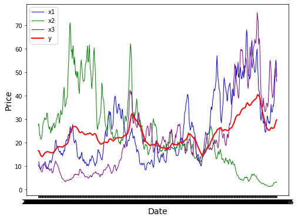
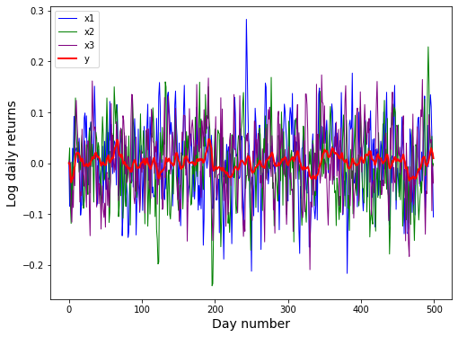
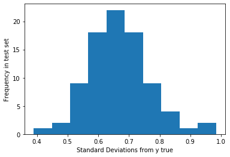
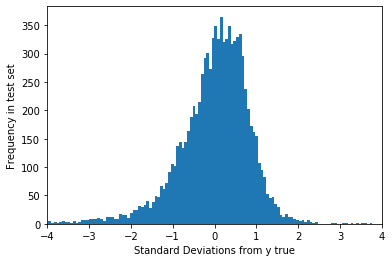

```python
import numpy as np
import pandas as pd
from matplotlib import pyplot as plt
from net import ConvProbNet
from simulate_data import generate_data
from parse_input import plot_input_data, transform_input_data, plot_transformed_data, make_train_test
```

# Model

We are given input data $X_t = (x_{1,t}, x_{2,t}, x_{3,t})$ which could be e.g. some sort of transformed log-normal daily returns. We also have $y_t$, which is some (probably stochastic) signal that we're interested in. We make the basic assumption that $y_{t+1}$ depends on $\{ X_t, X_{t-1}, X_{t-2}, ... X_{t-n}\}$ and also on some noise $\eta_t$. So then we can write $y_t = f(X_t, X_{t-1}, X_{t-2}, ... X_{t-n}, \eta_t)$. We would now like to build a conv-net that approximates $f$, up to the stochasticity in $y$. In other words we would like $f_{cnn}(X_t, X_{t-1}, X_{t-2}, ... X_{t-n}) = \mathcal{N}(\mu_t, \sigma^2_t)$ such that the likelihood of $y_t$ given $\mu_t$ and $\sigma^2_t$ is maximized.

## Loss function

At each time $y_t$ we want $p(y_t|\mu_t, \sigma^2_t)$ is max. The maximum likelihood estimation for a gaussian distribution given a single data observation is as follows

* $\mu_t = y_t$
* $\sigma^2_t = (\mu_t - y_t)^2$

That is a pretty simple excercise to solve. For example see [here](http://jrmeyer.github.io/machinelearning/2017/08/18/mle.html)

In order to incentivize our network to produce maximum likelihood parameters we can use the following mean squared error loss:

### $\mathcal{L} = \sum_{t \in batch}{(\mu_t - y_t)^2 + \lambda (\sigma^2_t - (\mu_t - y_t)^2)}$

Where $\lambda$ is a parameter we can choose that determines the relative weight of error estimation to mean estimation. This loss function has some nice properties. 
1. Obviously the model minimizes its loss function by producing $\mu_t = y_t$, as desired, and by producing $\sigma^2_t = (\mu_t - y_t)^2$, as desired.
2. If $\mu_t = y_t$ then the network is rewarded for setting $\sigma^2_t = 0$. In other words, if our network is very confident in its predictions then it should set the variance to zero. Another way to say this is that if $y$ is deterministic or not very noisy then our network should be closer to a simple regression
3. If $\mu_t \neq y_t$ then the network is rewarded for correctly expressing its uncertainty through the variance of the output distribution. Therefore our output distribution's variance expresses both the model's uncertainty in its prediction, and the inherent uncertainty in the target signal (it tells us something about $\eta$).

## Network architecture

We're expecting that $y_t = f(X_t, X_{t-1}, X_{t-2}, ... X_{t-n}, \eta_t)$, where $\eta_t$ is noise of some sort and $X_t = (x_{1,t}, x_{2,t}, x_{3,t})$ is a three dimensional time series (e.g. three stocks after normalizing and log-transforming), which itself contains some degree of autocorrelation. We want to leverage the autocorrelation of $X_t$ to infer the function $f$, and since in this case [autocorrelation is essentially just convolution](https://en.wikipedia.org/wiki/Convolution) it makes sense to use a conv-net, as directly prompted to in the problem statement. The parameters of the conv-net need to be reasoned through though. I ended up settling on the following first pass, although there's not really very strong theoretical underpinnings to ANNs yet so a lot of it involves tinkering to see what works best.

Let batch size be $B$, and we use a maximum sequence length of $N=14$ under the operational assumption that the input sequences are autocorrelated over a few days, but that their values two weeks ago or more do not affect the current value of the target signal.

1. Input layer (B, N, 3)
2. Conv 1D X2 (B, 64, N-2, 3)
3. Dropout + max pooling 1D (B, 64, (N-2)/2, 3)
4. Dense (B, 100)
5. Output (B, 2)

There are two convolution layers with 64 filters and a dense layer with output size 100. The final output is mu and sigma^2

The output of the conv 1d layers includes N-2 because we use a convolutional filter size 3, and then we max pool with pool size = 2 so we get down do (N-2)/2. The width 100, 64 filters, and batch size just come from intuition and practice, and in reality they will become hyperparameters that we fiddle with later when we're trying to get the best model (we can set up a script to automatically do a hyperparameter search).

The I built and defined the actual model in **net.py** and I simply import it and use it here. I'm calling it ConvProbNet

## Data

In the following, I'll run three experiments on the network.

1. Test that the model can produce accurate $\mu$: Feed in random $X$ along with a deterministic, constant valued $y = y_0$. The idea is to make sure that the network does what we want it to do, and that it has enough capacity to dramatically overtrain on simple data. (It is better to start with a network that is too large/deep and then worry about regularizing than to be stuck with a network that is too shallow to represent the underlying data patterns). In this experiment we want to see the model converge to always output $\mu_t = y_0$, $\sigma^2_t = 0$.

2. Test that the model can produce accurate $\sigma^2$: Feed in random $X$ along with stationary $y$ drawn from a gaussian $\mathcal{N}(\mu_0, \sigma^2_0)$. We want to see the model converge to always outputting $\mu_t = y_0$, $\sigma^2_t = \sigma^2_0$.

3. Simulate autocorrelated stationary signals $X$ and use a *known* function $y = f(X)$ (for example a simple exponential weighted moving average). Train the network for a while and see that it's performing reasonably well. We'll look at loss and some plots to evaluate the network. For this experiment I simulated data in **simulate_data.py** and wrote it out to a csv **input_data.csv**. It "looks" real in the sense that it's a csv with datestamps that needs to be read in, normalized, transformed, and prepped to be fed to the network. I define all the prep work in **parse_input.py** and just use the functions here.

4. Eventual (not implemented) grab actual signals from the wild and feed them to the network. Evaluate by using a train/test split, metric could be something like average $\frac{|\mu - y|}{\sigma}$, something along those lines. 


```python
#produce a random mu and sigma from the network before training, just to make sure everything
#is hooked up correctly

f = ConvProbNet().model
X = np.random.random((1, 14, 3)); y = np.random.random(1)
output = f([X[:1], y[:1]])
mu, sig = (output[0].numpy()[0][0], output[1].numpy()[0][0])
print(f'mu = {mu}, sigma squared = {sig}')
```

    mu = 0.014715185388922691, sigma squared = 0.02229337766766548


## Experiment 1: produce fixed mu with sigma = 0

We're going to generate a constant vector y, and we want the network to always output
$\mu = y$ and $\sigma = 0$


```python
#train
X = np.random.random((10000, 14, 3)); y = np.ones(10000)
f.fit([X,y], y, epochs=10)

#output mu and sigma^2, expect 1.0, 0.0
X = np.random.random((1, 14, 3)); y = np.random.random(1)
output = f([X[:1], y[:1]])
mu, sig = (output[0].numpy()[0][0], output[1].numpy()[0][0])
```

    Epoch 1/10
    313/313 [==============================] - 1s 2ms/step - loss: 0.0766 - dense_1_accuracy: 0.9675 - dense_2_accuracy: 0.0035
    Epoch 2/10
    313/313 [==============================] - 1s 2ms/step - loss: 0.0073 - dense_1_accuracy: 1.0000 - dense_2_accuracy: 0.0000e+00
    Epoch 3/10
    313/313 [==============================] - 1s 2ms/step - loss: 0.0038 - dense_1_accuracy: 1.0000 - dense_2_accuracy: 0.0000e+00
    Epoch 4/10
    313/313 [==============================] - 1s 2ms/step - loss: 0.0022 - dense_1_accuracy: 1.0000 - dense_2_accuracy: 0.0000e+00
    Epoch 5/10
    313/313 [==============================] - 1s 2ms/step - loss: 0.0013 - dense_1_accuracy: 1.0000 - dense_2_accuracy: 0.0000e+00
    Epoch 6/10
    313/313 [==============================] - 1s 3ms/step - loss: 7.4012e-04 - dense_1_accuracy: 1.0000 - dense_2_accuracy: 0.0000e+00
    Epoch 7/10
    313/313 [==============================] - 1s 3ms/step - loss: 4.5538e-04 - dense_1_accuracy: 1.0000 - dense_2_accuracy: 0.0000e+00
    Epoch 8/10
    313/313 [==============================] - 1s 2ms/step - loss: 2.2553e-04 - dense_1_accuracy: 1.0000 - dense_2_accuracy: 0.0000e+00
    Epoch 9/10
    313/313 [==============================] - 1s 2ms/step - loss: 1.0551e-04 - dense_1_accuracy: 1.0000 - dense_2_accuracy: 0.0000e+00
    Epoch 10/10
    313/313 [==============================] - 1s 2ms/step - loss: 4.0912e-05 - dense_1_accuracy: 1.0000 - dense_2_accuracy: 0.0000e+00


```python
print(f'mu = {mu}, sigma squared = {sig}')
```

    mu = 0.9917384386062622, sigma squared = 0.0016207885928452015


Not too bad! Now let's see if it can learn to output the parameters of the distribution of a stationary y.
In other words, we are going to draw y from N(mu, sigma^2) and want the network to learn that and always produce the same mu and sigma^2

## Experiment 2: produce fixed mu and sigma


```python
#train
X = np.random.random((10000, 14, 3)); y = np.random.normal(1,.5,size=10000)
f.fit([X,y], y, epochs=10)

#output mu and sigma^2, expect 1, 0.25
X = np.random.random((1, 14, 3)); y = np.random.random(1)
output = f([X[:1], y[:1]])
mu, sig = (output[0].numpy()[0][0], output[1].numpy()[0][0])
```

    Epoch 1/10
    313/313 [==============================] - 1s 3ms/step - loss: 0.3884 - dense_1_accuracy: 0.0000e+00 - dense_2_accuracy: 0.0000e+00
    Epoch 2/10
    313/313 [==============================] - 1s 2ms/step - loss: 0.3821 - dense_1_accuracy: 0.0000e+00 - dense_2_accuracy: 0.0000e+00
    Epoch 3/10
    313/313 [==============================] - 1s 3ms/step - loss: 0.3822 - dense_1_accuracy: 0.0000e+00 - dense_2_accuracy: 0.0000e+00
    Epoch 4/10
    313/313 [==============================] - 1s 3ms/step - loss: 0.3811 - dense_1_accuracy: 0.0000e+00 - dense_2_accuracy: 0.0000e+00
    Epoch 5/10
    313/313 [==============================] - 1s 3ms/step - loss: 0.3822 - dense_1_accuracy: 0.0000e+00 - dense_2_accuracy: 0.0000e+00
    Epoch 6/10
    313/313 [==============================] - 1s 3ms/step - loss: 0.3822 - dense_1_accuracy: 0.0000e+00 - dense_2_accuracy: 0.0000e+00
    Epoch 7/10
    313/313 [==============================] - 1s 3ms/step - loss: 0.3805 - dense_1_accuracy: 0.0000e+00 - dense_2_accuracy: 0.0000e+00
    Epoch 8/10
    313/313 [==============================] - 1s 3ms/step - loss: 0.3798 - dense_1_accuracy: 0.0000e+00 - dense_2_accuracy: 0.0000e+00
    Epoch 9/10
    313/313 [==============================] - 1s 3ms/step - loss: 0.3813 - dense_1_accuracy: 0.0000e+00 - dense_2_accuracy: 0.0000e+00
    Epoch 10/10
    313/313 [==============================] - 1s 3ms/step - loss: 0.3807 - dense_1_accuracy: 0.0000e+00 - dense_2_accuracy: 0.0000e+00A: 0s - loss: 0.3777 - dense_1_accuracy: 0.0000e+00 - dense_2_accuracy: 0


```python
print(f'mu = {mu}, sigma squared = {sig}')
```

    mu = 1.0553873777389526, sigma squared = 0.270428866147995


Again, not too bad! We were looking for 1 and 0.25

But this is easy. Let's see how the network does on some simulated data.

Check out the **simulate_data** and **parse_input** scripts, but here's what I did to simulate data.

1. x1, x2, and x3 have log daily returns that are gaussian distributed, correlated with each other, and autocorrelated over two days.
2. y is an exponentially weighted moving average with a halflife of one week running over x1, x2, x3. So data in x1, x2, x3 contain information about future y values.
3. the network uses the 3 new values x1(t), x2(t) and x3(t) as well as 13 days worth of older values of x1 x2 x3 in order to predict y(t).
4. parse_input just has some plotting functions I wrote, and normalizes the data into log-daily-returns
5. finally parse_input has make_train_test which builds up training and test data for the network

## Experiment 3: use simulated data


```python
df = pd.read_csv('input_data.csv')
df.head()
```


<div>
<style scoped>
    .dataframe tbody tr th:only-of-type {
        vertical-align: middle;
    }

    .dataframe tbody tr th {
        vertical-align: top;
    }

    .dataframe thead th {
        text-align: right;
    }
</style>
<table border="1" class="dataframe">
  <thead>
    <tr style="text-align: right;">
      <th></th>
      <th>Unnamed: 0</th>
      <th>x1</th>
      <th>x2</th>
      <th>x3</th>
      <th>target</th>
      <th>date</th>
    </tr>
  </thead>
  <tbody>
    <tr>
      <th>0</th>
      <td>0</td>
      <td>10.789147</td>
      <td>27.286684</td>
      <td>11.775043</td>
      <td>16.616958</td>
      <td>2017-01-01</td>
    </tr>
    <tr>
      <th>1</th>
      <td>1</td>
      <td>9.910168</td>
      <td>28.115604</td>
      <td>11.836738</td>
      <td>16.618993</td>
      <td>2017-01-02</td>
    </tr>
    <tr>
      <th>2</th>
      <td>2</td>
      <td>9.921680</td>
      <td>25.979636</td>
      <td>11.181378</td>
      <td>16.279763</td>
      <td>2017-01-03</td>
    </tr>
    <tr>
      <th>3</th>
      <td>3</td>
      <td>9.233654</td>
      <td>23.072619</td>
      <td>10.225685</td>
      <td>15.673707</td>
      <td>2017-01-04</td>
    </tr>
    <tr>
      <th>4</th>
      <td>4</td>
      <td>8.757418</td>
      <td>23.125527</td>
      <td>9.104205</td>
      <td>15.188115</td>
      <td>2017-01-05</td>
    </tr>
  </tbody>
</table>
</div>


```python
%matplotlib inline
plot_input_data(df);
```


    

    


```python
X,y = transform_input_data(df)
plot_transformed_data(X,y);
```


    

    


```python
#we're ready to train!
Xtrain, ytrain, Xtest, ytest = make_train_test(X,y)
f.fit([Xtrain,ytrain], ytrain, epochs=10)
```

    Epoch 1/10
    13/13 [==============================] - 0s 3ms/step - loss: 0.2978 - dense_1_accuracy: 0.0000e+00 - dense_2_accuracy: 0.0000e+00
    Epoch 2/10
    13/13 [==============================] - 0s 3ms/step - loss: 0.0178 - dense_1_accuracy: 0.0000e+00 - dense_2_accuracy: 0.0000e+00
    Epoch 3/10
    13/13 [==============================] - 0s 3ms/step - loss: 0.0084 - dense_1_accuracy: 0.0000e+00 - dense_2_accuracy: 0.0000e+00
    Epoch 4/10
    13/13 [==============================] - 0s 3ms/step - loss: 0.0037 - dense_1_accuracy: 0.0000e+00 - dense_2_accuracy: 0.0000e+00
    Epoch 5/10
    13/13 [==============================] - 0s 3ms/step - loss: 0.0022 - dense_1_accuracy: 0.0000e+00 - dense_2_accuracy: 0.0000e+00
    Epoch 6/10
    13/13 [==============================] - 0s 3ms/step - loss: 0.0028 - dense_1_accuracy: 0.0000e+00 - dense_2_accuracy: 0.0000e+00
    Epoch 7/10
    13/13 [==============================] - 0s 3ms/step - loss: 0.0030 - dense_1_accuracy: 0.0000e+00 - dense_2_accuracy: 0.0000e+00
    Epoch 8/10
    13/13 [==============================] - 0s 3ms/step - loss: 0.0022 - dense_1_accuracy: 0.0000e+00 - dense_2_accuracy: 0.0000e+00
    Epoch 9/10
    13/13 [==============================] - 0s 3ms/step - loss: 0.0019 - dense_1_accuracy: 0.0000e+00 - dense_2_accuracy: 0.0000e+00
    Epoch 10/10
    13/13 [==============================] - 0s 3ms/step - loss: 0.0016 - dense_1_accuracy: 0.0000e+00 - dense_2_accuracy: 0.0000e+00


    <tensorflow.python.keras.callbacks.History at 0x6427a21d0>


There wasn't very much data in the input file. But let's evaluate our model's performance.

We're going to get mu and sigma for each day in the test period, and then compare that to y for each day in the test period. If our model is doing well, then $y_t$ should not be too many standard deviations from the mean of our output distribution $\mathcal{N}(\mu_t, \sigma^2_t)$. So we calculate all the deviations in the test period

deviation = $\frac{|\mu_t - y_t|}{\sigma_t}$

then we'll make a histogram and look at the deviations


```python
mu_test, sig_test = f([Xtest, np.ones(Xtest.shape[0])])
mu_test = mu_test.numpy().flatten()
sig_test = sig_test.numpy().flatten()
stds_test = np.sqrt(sig_test)

deviations = np.abs(mu_test - ytest)/stds_test
_ = plt.hist(deviations)
plt.xlabel("Standard Deviations from y true")
plt.ylabel("Frequency in test set")
```


    Text(0, 0.5, 'Frequency in test set')


    

    


Not excellent! Let's see how it does if we feed it a lot more training data (50,000 examples this time)


```python
X,y = transform_input_data(generate_data(Ndays=50000))
Xtrain, ytrain, Xtest, ytest = make_train_test(X,y)
f.fit([Xtrain, ytrain], ytrain, epochs=10)
```

    Epoch 1/10
    1250/1250 [==============================] - 3s 3ms/step - loss: 1.0864e-04 - dense_4_accuracy: 0.0000e+00 - dense_5_accuracy: 0.0000e+00
    Epoch 2/10
    1250/1250 [==============================] - 3s 3ms/step - loss: 8.2467e-05 - dense_4_accuracy: 0.0000e+00 - dense_5_accuracy: 0.0000e+00
    Epoch 3/10
    1250/1250 [==============================] - 3s 3ms/step - loss: 8.0153e-05 - dense_4_accuracy: 0.0000e+00 - dense_5_accuracy: 0.0000e+00
    Epoch 4/10
    1250/1250 [==============================] - 3s 2ms/step - loss: 7.9234e-05 - dense_4_accuracy: 0.0000e+00 - dense_5_accuracy: 0.0000e+00
    Epoch 5/10
    1250/1250 [==============================] - 3s 2ms/step - loss: 7.8800e-05 - dense_4_accuracy: 0.0000e+00 - dense_5_accuracy: 0.0000e+00
    Epoch 6/10
    1250/1250 [==============================] - 3s 2ms/step - loss: 7.8930e-05 - dense_4_accuracy: 0.0000e+00 - dense_5_accuracy: 0.0000e+00
    Epoch 7/10
    1250/1250 [==============================] - 4s 3ms/step - loss: 7.8200e-05 - dense_4_accuracy: 0.0000e+00 - dense_5_accuracy: 0.0000e+00
    Epoch 8/10
    1250/1250 [==============================] - 3s 3ms/step - loss: 7.7725e-05 - dense_4_accuracy: 0.0000e+00 - dense_5_accuracy: 0.0000e+00
    Epoch 9/10
    1250/1250 [==============================] - 3s 3ms/step - loss: 7.7075e-05 - dense_4_accuracy: 0.0000e+00 - dense_5_accuracy: 0.0000e+00
    Epoch 10/10
    1250/1250 [==============================] - 3s 3ms/step - loss: 7.7144e-05 - dense_4_accuracy: 0.0000e+00 - dense_5_accuracy: 0.0000e+00


    <tensorflow.python.keras.callbacks.History at 0x652f2c358>


```python
mu_test, sig_test = f([Xtest, np.ones(Xtest.shape[0])])
mu_test = mu_test.numpy().flatten()
sig_test = sig_test.numpy().flatten()
stds_test = np.sqrt(sig_test)

deviations = (mu_test - ytest)/stds_test
_ = plt.hist(deviations, bins=1000)
plt.xlabel("Standard Deviations from y true")
plt.ylabel("Frequency in test set")
plt.xlim(-4,4)
```

    /Users/dyanni3/anaconda3/lib/python3.7/site-packages/ipykernel_launcher.py:4: RuntimeWarning: invalid value encountered in sqrt
      after removing the cwd from sys.path.


    (-4, 4)


    

    


Much better! This now looks roughly like half a normal distribution. Most of the time our model is right, but rare outliers occur!


```python

```
